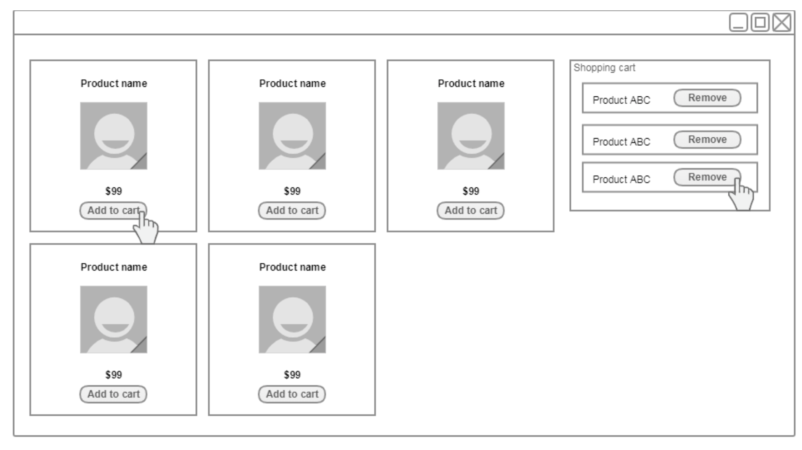
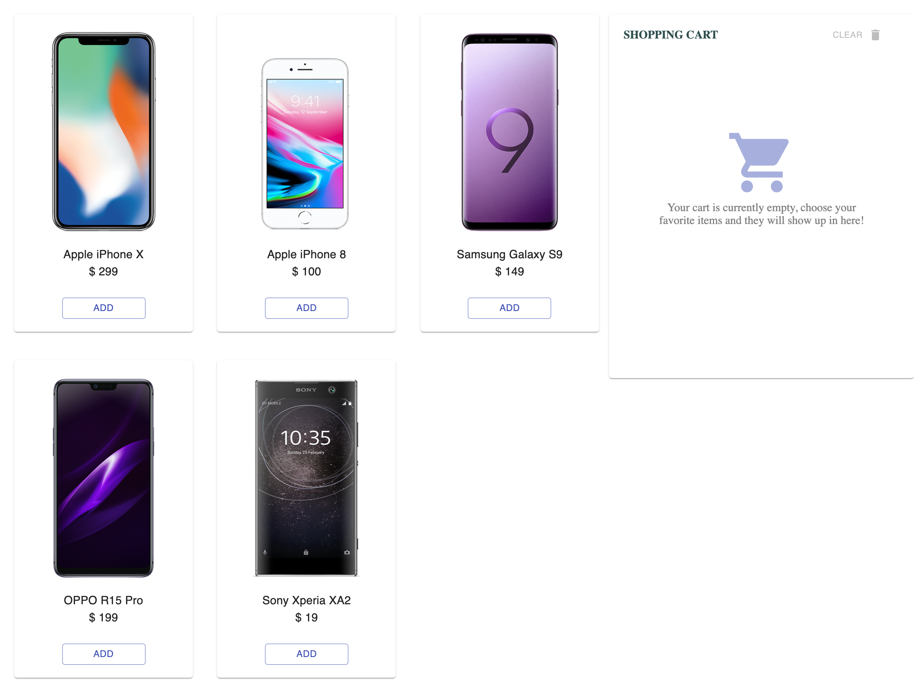
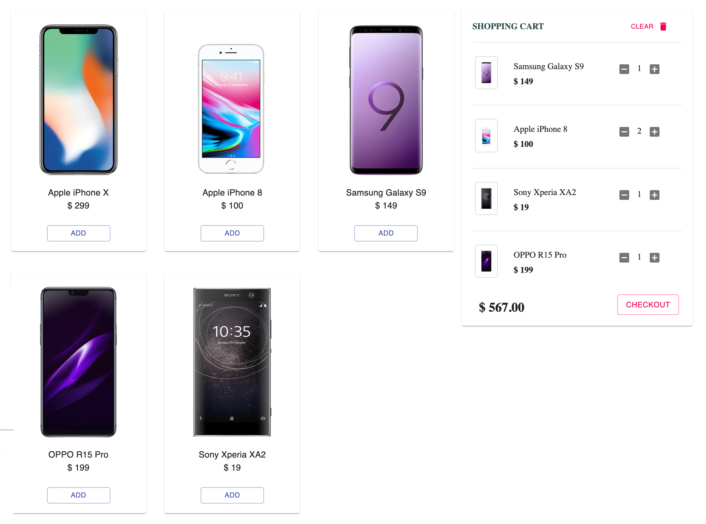
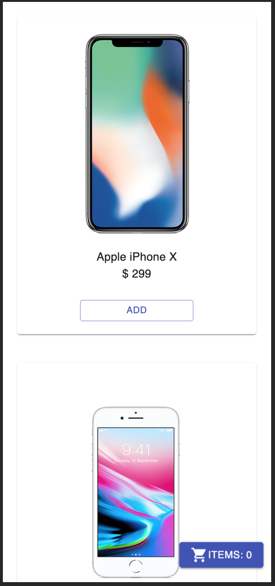
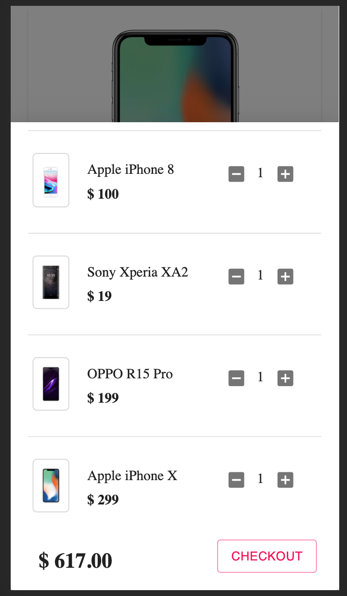

# Shopping cart

This is a frontend application for the shopping cart. In this application, a customer can see a range of mobile phones and add to cart. User can also update items from the cart.

## User stories
1. As a customer, I want to see a range of mobile phones So I can click one to add to my cart,
2. As a customer, I want to remove items from my shopping cart So I can update my shopping cart

## Assumptions & New features
1. An user can only add the product into the cart if the product is published.
2. An user can add the same product multiple times.
2. An user can add/reduce the product amount directly from the cart.
3. An user can remove all products in the cart.
4. An user can see the total price of the products in the cart.
5. An user can see the empty cart message if there is no item in cart.
6. A mobile user will see a cart icon to show the cart.
7. A mobile user will use drawer to view the cart.

## Directory Structure

```bash
frontend
├── src                             <-- Source code for this application
│   ├── __tests__                   <-- All unit tests
│   ├── api                         <-- Handle calling server API
│   ├── components                  <-- All web components
│   │   └── Card.tsx                <-- Product card component
│   │   └── Cart.tsx                <-- Cart component
│   │   └── CartDrawer.tsx          <-- Drawer component for mobile view
│   │   └── CartItem.tsx            <-- Item component in cart
│   │   └── Products.tsx            <-- All products component in cart
│   │   └── App.tsx                 <-- Main layout
│   ├── constants                   <-- Constant values for this application
│   ├── contexts                    <-- React context api and states
│   ├── types                       <-- Interfaces and types
│   ├── utils                       <-- Utils functions
│   └── index.tsx                   <-- Entry of the application
├── README.md                       <-- This instructions file
├── package.json                    <-- NodeJS dependencies and scripts
├── tsconfig.json                   <-- Typescript config file
├── tslint.json                     <-- Lint config
└
```

## Command Lines

* ```npm install``` installs dependencies.
* ```npm start``` is for running the application
* ```npm test``` is for unit testing.
* ```npm run coverage``` is for running both unit and integration tests with coverage report.

## UI/UX
* This application tries to use the original design in `challenge document`.
* Responsive view works across mobile and desktop devices.
* For mobile view, the cart will hide and show a cart icon.
* A drawer will show if user click on the cart icon in mobile view.

### Original Design

### Desktop view for empty cart

### Desktop view with cart items

### Mobile view basic

### Mobile view with drawer


## Technology used
* This application uses `typesctipt` `react` as the framework. 
* It uses `context api` as state management. 
* `Testing library` as the testing tool.
* `Material UI` for UI components.
* This application uses TDD during the implementation
